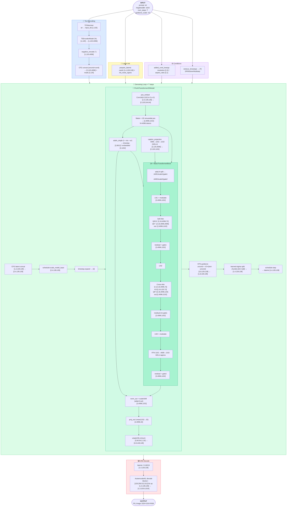

# PixArt-α XL/2 1024-MS Pipeline Flow

```mermaid
flowchart TD
    A(["`**INPUT**
    prompt: str
    height/width: 1024
    num_steps: T
    guidance_scale: 4.5`"]) --> B

    subgraph TEXT["📝 Text Encoding"]
        B["T5Tokenizer
        str → input_ids [1,120]"] --> C
        C["T5EncoderModel 24L
        [1,120] → [1,120,4096]"] --> D
        D["negative_encode ('')
        [1,120,4096]"] --> E
        E["CFG concat (uncond+cond)
        → [2,120,4096] + mask [2,120]"]
    end

    subgraph LATENT["🎲 Latent Init"]
        F["prepare_latents
        randn [1,4,128,128] × init_noise_sigma"]
    end

    subgraph COND["⚙️ Conditions"]
        G["added_cond_kwargs
        resolution [2,2] / aspect_ratio [2,1]"]
        H["retrieve_timesteps → [T]
        DPMSolverMultistep"]
    end

    A --> F
    A --> G
    A --> H

    E --> LOOP
    F --> LOOP
    G --> LOOP
    H --> LOOP

    subgraph LOOP["🔁 Denoising Loop × T steps"]
        L1["CFG latent concat
        [1,4,128,128] → [2,4,128,128]"] --> L2
        L2["scheduler.scale_model_input
        [2,4,128,128]"] --> L3
        L3["timestep.expand → [2]"] --> DIT

        subgraph DIT["🧠 PixArtTransformer2DModel"]
            direction TB
            D1["pos_embed Conv2d(4,1152,k=2,s=2)
            [2,4,128,128] → [2,1152,64,64]"] --> D2
            D2["flatten + 2D sinusoidal pos
            → [2,4096,1152]  N=4096 tokens"] --> D3
            D3["adaln_single (t + res + ar)
            → timestep [2,6912] / embedded [2,1152]"]
            D4["caption_projection
            4096→1152→1152 (GELU)
            [2,120,4096] → [2,120,1152]"]

            D2 --> BLOCKS
            D3 --> BLOCKS
            D4 --> BLOCKS

            subgraph BLOCKS["28 × BasicTransformerBlock"]
                direction TB
                B1["adaLN split → shift1/scale1/gate1
                              shift2/scale2/gate2"] --> B2
                B2["LN1 + modulate
                [2,4096,1152]"] --> B3
                B3["Self-Attn
                Q/K/V: [2,16,4096,72]
                QKᵀ:   [2,16,4096,4096]
                out:   [2,4096,1152]"] --> B4
                B4["residual + gate1
                [2,4096,1152]"] --> B5
                B5["LN2"] --> B6
                B6["Cross-Attn
                Q: [2,16,4096,72]
                KV:[2,16,120,72]
                QKᵀ:[2,16,4096,120]
                out:[2,4096,1152]"] --> B7
                B7["residual (no gate)
                [2,4096,1152]"] --> B8
                B8["LN3 + modulate"] --> B9
                B9["FFN 1152→4608→1152
                GELU-approx"] --> B10
                B10["residual + gate2
                [2,4096,1152]"]
            end

            BLOCKS --> O1
            D3 --> O1
            O1["norm_out + scale/shift (adaLN out)
            [2,4096,1152]"] --> O2
            O2["proj_out Linear(1152→32)
            [2,4096,32]"] --> O3
            O3["unpatchify einsum
            [2,64,64,2,2,8] → [2,8,128,128]"]
        end

        DIT --> L4
        L4["CFG guidance
        uncond + 4.5×(text-uncond)
        [2,8,128,128] → [1,8,128,128]"] --> L5
        L5["learned-sigma split
        chunk(2,dim=1)[0] → [1,4,128,128]"] --> L6
        L6["scheduler.step
        → latents [1,4,128,128]"]
    end

    subgraph VAE["🖼️ VAE Decode"]
        V1["latents / 0.18215
        [1,4,128,128]"] --> V2
        V2["AutoencoderKL decode
        blocks=[128,256,512,512] 8x up
        [1,4,128,128] → [1,3,1024,1024]"]
    end

    LOOP --> VAE
    V2 --> Z
    Z(["`**OUTPUT**
    PIL.Image 1024×1024 RGB`"])

    style TEXT fill:#dbeafe,stroke:#3b82f6
    style LATENT fill:#fef9c3,stroke:#eab308
    style COND fill:#f3e8ff,stroke:#a855f7
    style LOOP fill:#dcfce7,stroke:#22c55e
    style DIT fill:#d1fae5,stroke:#10b981
    style BLOCKS fill:#a7f3d0,stroke:#059669
    style VAE fill:#ffe4e6,stroke:#f43f5e
```
